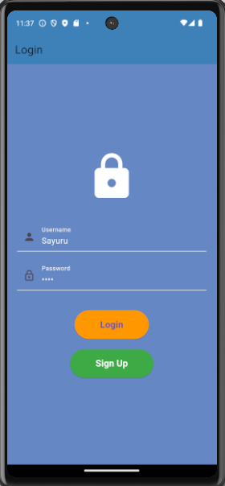
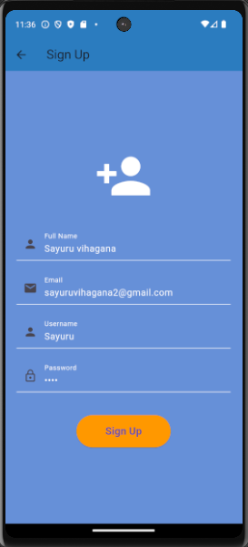
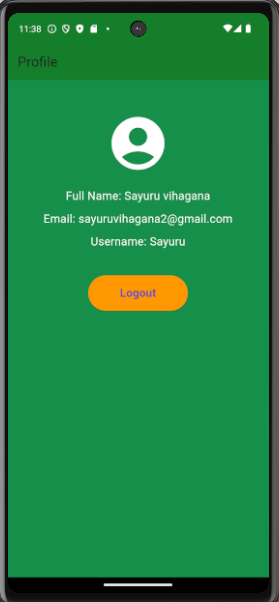

# My Flutter App

This is a Flutter-based mobile application designed to allow users to register, log in, and view their profile.

---

## ✨ Features

- **User Authentication**: Sign up, log in, and logout functionality.
- **Profile Management**: Displays the user's profile information (Full Name, Email, Username).

---

## 🛠️ Technologies Used

- **Language**: Dart  
- **Framework**: Flutter  
- **Database**: SQLite

---

## 📱 Screenshots

---

### Prerequisites

- Flutter (https://flutter.dev/docs/get-started/install)
- Dart SDK
- Android Studio (or another IDE that supports Flutter)

---

## 👨‍💻 Author
Vihagana99
[GitHub Profile](https://github.com/vihagana99)
